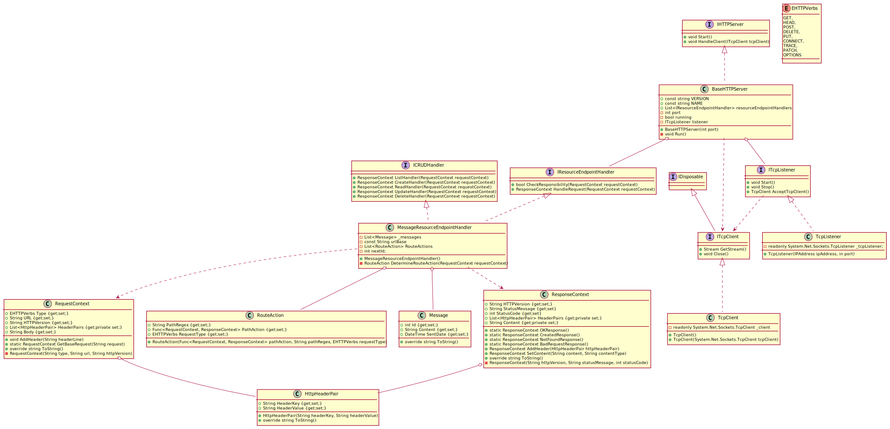

# SWE1-REST-HTTP-Webservice

Webservice handler based on a restful HTTP-based server. For testing purposes a message resource is created and all corresponding methods (CRUD) are implemented. This project was programmed with Rider.

# Special explanatory notes

Further steps are explained in this section.

## Class Diagram

BaseHTTPServer receives the HTTP-Request an reads the from the NetworkStream. Afterwards all resource endpoint handlers are iterated and the responsible one is selected. Depending on the url structure and the method (GET, POST, PUT, DELETE) different CRUDHandler methods are used. Those CRUD handler methods do their "task" and return a suitable response (BAD REQUEST, NOT FOUND, OK, ...). To test the server interfaces for mocking the TcpClient and TcpListener were created. Although there are way more methods in said classes, only the methods that are used in the server are tested.

A "normal" response can not be created, because the constructor is private. Only certain response types (OK, ...) can be created through static and public methods.

### Route Actions

I wasn't really sure how to implement different endpoints and check if they are valid. That's why i created the RouteAction class. It consists of the Type/method (e.g.: GET), a regex expression which is used for validating the requested url and a Func. The func is executed if the regex expression and the method equal the HTTP request.

I myself know that the names "RouteAction" and "PathAction" can be misleading. After all, instead of actions funcs are used. I did not rename them because the names "RouteFunc" and "PathFunc" sound pretty weird.

### IHTTPServer & BaseHTTPServer

Personally, I think that (aside from RequestContext) the interface IHTTPServer and the class BaseHTTPServer could probably have some (or a lot of) similarities with the projects of other students. At the beginning, I wasn't really sure how to start this project. That's when I stumbled over the following tutorials:

* [Tutorial Part 1](https://youtu.be/HFnJLv2Q1go)
* [Tutorial Part 2](https://youtu.be/8d5JWDuG2Tg)
* [Tutorial Part 3](https://youtu.be/PPX2V10eQkI)

This tutorial series is pretty much the "foundation" of this project. However, I changed the code at some points, so at least it's not a blatant ripoff.

There are not a lot of methods in this part of the project. The server consists of 3 methods. They are called "Start", "Run" and "HandleClient". In "Start" a thread with the method "Run" is started. In "Run" the server waits for a client (CURL-Script, Insomnia, Browser, ...) to connect. If a client connects, the client is "forwarded" to "HandleClient" where the message from the NetworkStream is read. It checks if one of the endpoints is "responsible" for the request. If not, a "Bad Request"-response is sent back.

In the beginning, the server used the standard implementation of TcpListener and TcpClient. Now it uses classes, which implement the ITcpClient and ITcpListener interfaces (have methods that are relevant to the server).

### RequestContext, ResponseContext and HTTPHeaderPair

RequestContext and ResponseContext represent HTTP requests and responses. The values of the first line of request/response are in seperate variables. Headers are in a list of HTTPHeaderPair-objects (two values -> key and value). In both Response- and RequestContext the constructor can not be accessed because it is private. Instead methods can be used to create the foundation of request/response (e.g.: GetBaseRequest, OKResponse, CreatedResponse,...).

### EndpointHandlers

EndpointHandlers implement the interface IResourceEndpointHandler, which contains the two necessary methods. Furthermore, if the endpoint handlers are for resources (e.g.: messages, cards, packages, ...) the ICRUDHandler-interface can be implemented. Currently the MessageResourceEndpointHandler has an ongoing integer representing a sequence. In the next project it can be removed due to the usage of databases.

HandleRequest receives every request and uses DetermineRouteAction to get the correct RouteAction for a request. Afterwards the requests are forwarded to the corresponding methods.

EndpointHandlers could be implemented using the Singleton-Pattern to guarantee that different BaseHTTPServer instances have the same messages. However, as soon as databases are being used, it doesn't really matter anymore (at least in my opinion). Depending on the request the requested data could be taken from the database instead.

## Unit Tests & Integration tests

The project has several unit tests. They are in a Unit-Test project inside the solution. Sometimes, I wasn't really sure if I should test certain parts (constructor, ...) of the code, but I tested said parts anyways.

Furthermore the project was tested using Insomnia. The insomnia requests are in the repo ("integration_tests_insomnia.json") and can be imported.
